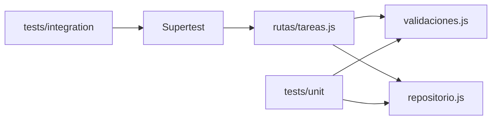

# Plan: API To-Do educativa para PRO402 (JavaScript)

## Decisión de stack

Preferencia del curso: **JavaScript / Node.js**. Se adaptan los equivalentes pedagógicos de pytest/httpx:

- **Node.js** (CommonJS, más simple para alumnos sin experiencia previa)
- **Express** (API REST mínima y legible)
- **Jest** (runner de pruebas; estándar en el ecosistema JS)
- **Supertest** (cliente HTTP sobre la app Express, sin levantar puerto real — equivalente a httpx)
- Almacenamiento **en memoria** (`Map` + contador de IDs), reiniciable por prueba

Se mantiene el dominio **To-Do** (CRUD + estadísticas).

## Estructura del proyecto

```
qa-api-workshop/
├── src/
│   ├── app.js                 # Crea y exporta la app Express (sin listen)
│   ├── server.js              # Arranca el servidor (listen)
│   ├── validaciones.js        # Reglas de negocio puras (sin HTTP)
│   ├── repositorio.js         # CRUD en memoria + estadísticas
│   └── rutas/
│       └── tareas.js          # Endpoints REST
├── tests/
│   ├── helpers/
│   │   └── appTest.js         # Factory: app + repo fresco para cada prueba
│   ├── unit/
│   │   ├── validaciones.test.js
│   │   └── repositorio.test.js
│   └── integration/
│       ├── crudTareas.test.js
│       └── estadisticas.test.js
├── package.json
├── jest.config.js
├── README.md
└── ejemplos_casos_prueba.md
```

## API a implementar

- `POST /tareas` — crear
- `GET /tareas` — listar
- `GET /tareas/:id` — obtener por id
- `PUT /tareas/:id` — actualizar
- `DELETE /tareas/:id` — eliminar
- `GET /estadisticas` — conteo por estado

Campos: `id`, `titulo`, `descripcion`, `estado` (`pendiente` | `en_progreso` | `completada`), `fecha_creacion`.

Validaciones en [`src/validaciones.js`](src/validaciones.js) (separadas del HTTP para unit-testear):

- Título obligatorio, longitud 3–100
- Estado solo valores definidos
- Descripción opcional (string)

Errores HTTP: `400` (validación) y `404` (no encontrada). Respuestas JSON con mensaje claro.

## Capas y flujo



- Lógica pura (`validaciones.js`, `repositorio.js`) → **unitarias**
- Endpoints vía Supertest sobre `app` exportada → **integración** (repo en memoria limpio por fixture/`beforeEach`)

## Pruebas

### Unitarias (`tests/unit`)

- Título vacío, corto (&lt;3), exacto 3, exacto 100, &gt;100
- Estado válido / inválido
- Repositorio: crear, obtener, actualizar, eliminar, id inexistente, estadísticas

Cada test con comentario en español del **porqué** existe.

### Integración (`tests/integration`)

- CRUD feliz completo
- `GET/PUT/DELETE` de id inexistente → 404
- `POST/PUT` con título o estado inválido → 400
- Valores límite del título vía HTTP
- `GET /estadisticas` tras crear tareas en distintos estados

Helper [`tests/helpers/appTest.js`](tests/helpers/appTest.js): crea app Express inyectando un repositorio nuevo (para aislamiento entre tests).

### Configuración Jest ([`jest.config.js`](jest.config.js))

Equivalente pedagógico a `pytest.ini` con marcadores `unit` / `integration`:

- Proyectos Jest (o `testMatch` + scripts npm) que separan carpetas
- Scripts en `package.json`:
  - `npm test` — todas
  - `npm run test:unit` — solo unitarias
  - `npm run test:integration` — solo integración

## Documentación

### [`README.md`](README.md) (español)

- Qué es y para qué sirve (curso PRO402)
- Instalación: `npm install`
- Correr API: `npm start` (o `node src/server.js`)
- Correr pruebas: todas / solo unit / solo integration
- Tabla: qué tipo de prueba cubre qué parte del código (`validaciones`, `repositorio`, rutas/endpoints)

### [`ejemplos_casos_prueba.md`](ejemplos_casos_prueba.md)

5 casos en tabla: ID, descripción, entrada, resultado esperado, tipo (unitaria/integración). Mezcla feliz + error + límite.

## Estilo pedagógico

- Nombres y comentarios en **español**
- CommonJS (`require`/`module.exports`), sin TypeScript ni bundlers
- Código corto, sin capas innecesarias
- Sin auth, sin DB real, sin Docker

## Dependencias (`package.json`)

- Producción: `express`
- Desarrollo: `jest`, `supertest`

## Orden de implementación

1. `validaciones.js` + `repositorio.js`
2. Rutas Express + `app.js` / `server.js`
3. `package.json` + `jest.config.js`
4. Pruebas unitarias
5. Pruebas de integración + helper
6. README y casos de ejemplo
7. Verificar que `npm test` pase en verde
